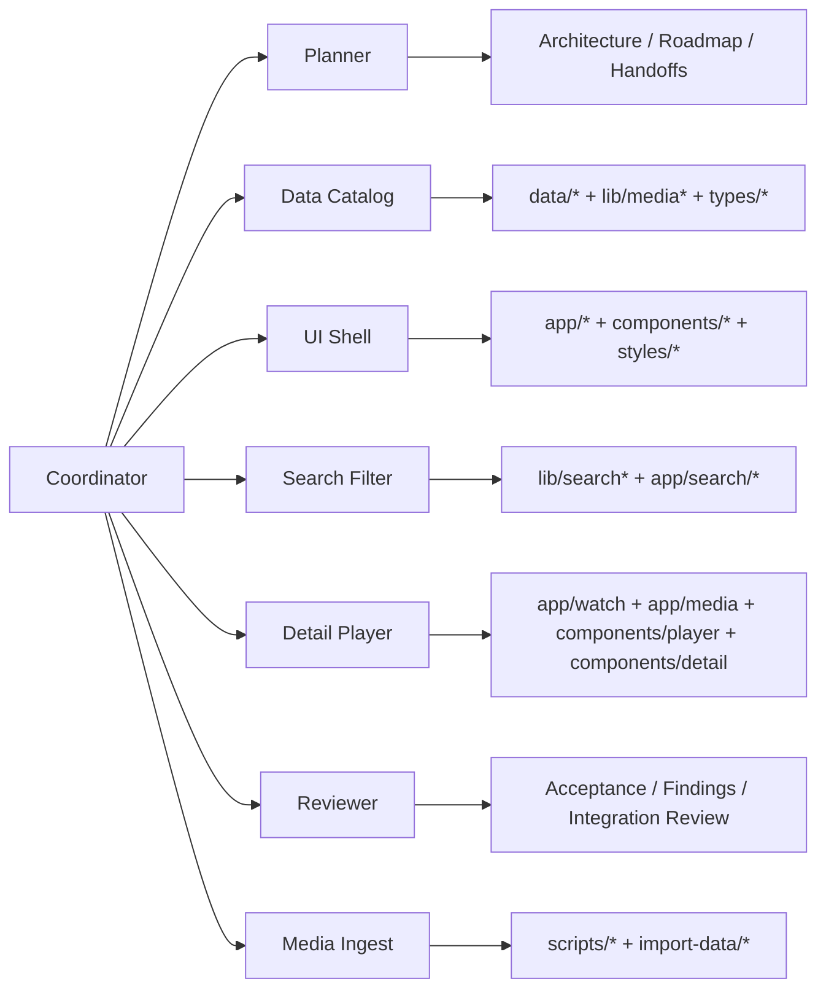
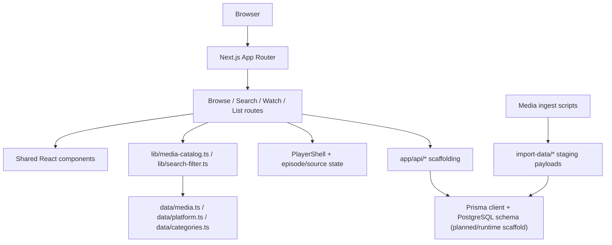
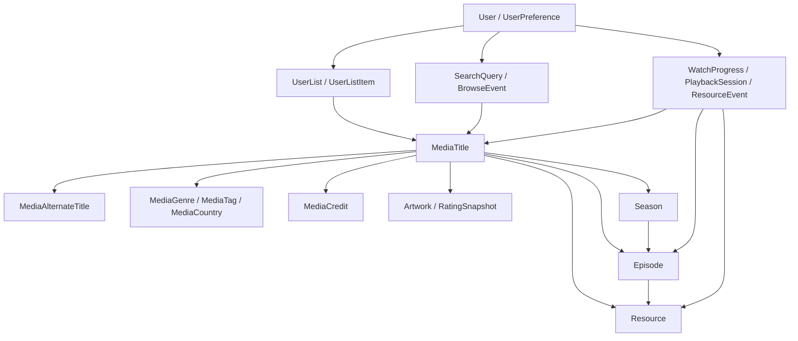
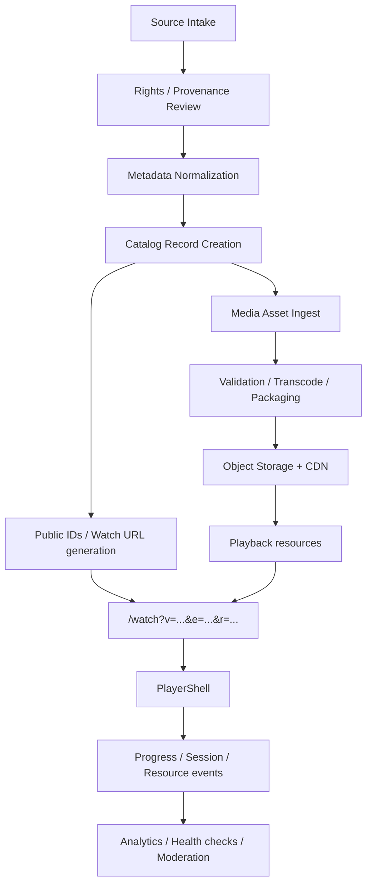

# Media Catalog Demo (Codex Multi-Agent Project)

Current project version: `0.30.0`

This project started as a front-end information-architecture recreation of a media catalog website and is now moving into a backend-first aggregation phase using Codex with a multi-agent workflow.

The active direction is no longer just shell replication. The next milestone is a backend for lawful content intake, normalization, review/publish, and source operations.

Versioning follows the project rules in [docs/versioning.md](/Users/livefree/projects/media-website-v2/docs/versioning.md).

Backend delivery and completion workflow is tracked in [docs/backend-delivery-workflow.md](/Users/livefree/projects/media-website-v2/docs/backend-delivery-workflow.md).

## Goals

Reproduce the following structure:

- Homepage with media grid
- Category pages (movie / series / anime)
- Search page
- Media detail page
- Player shell page

## Tech Stack

- Next.js (App Router)
- TypeScript
- CSS + CSS Modules
- Prisma schema modeling
- HLS.js for HLS playback

## How the Project is Organized

Agents work in parallel using the following responsibilities:

| Agent | Responsibility |
|------|---------------|
| Planner | project architecture |
| UI Shell | layout and styling |
| Data Catalog | media schema and dataset |
| Media Ingest | local library scanning and staging manifests |
| Search Filter | search and filtering |
| Detail Player | detail page and player shell |
| Reviewer | layout and architecture audit |

## Module Responsibility Diagram

## Current Runtime Architecture

## Database Layer Structure

The current Prisma schema already models the main platform layers even though the public app is still mostly seed-backed at runtime.

### Database domains

- `User / UserPreference`
  Accounts, plan, locale, playback preferences, provider preferences
- `MediaTitle`
  Core catalog record with public ID, slug, type, status, ratings, release metadata
- `Season / Episode`
  Episodic structure and per-episode navigation
- `Resource`
  Stream, download, subtitle, trailer, provider/format/status state
- `Taxonomy and credits`
  Genres, tags, countries, cast/crew, alternate titles, artwork
- `User activity`
  Search, browse events, watch progress, playback sessions, resource actions
- `Lists`
  Watchlist, favorites, history, curated/public list structures

## End-to-End Flow

### Current implementation state of the flow

- Implemented now:
  Browse/search/watch routes, player UI, public watch URL model, seed catalog shaping, local ingest scripts, Prisma schema draft
- Planned next:
  Lawful free-video source intake, rights verification, hosted/transcoded asset pipeline, DB-backed catalog reads, health checks, moderation workflow

## Coordinator Workflow

1. Read `task.md`
2. Update `docs/roadmap.md`
3. Assign tasks to sub-agents inside the Coordinator thread
4. Require each agent to branch from the latest `main`
5. Let each agent commit within its ownership scope
6. Integrate accepted work back into `main`
7. Use the refreshed integration branch as the base for the next dependent agent

## Current Maturity Notes

- The current app is coherent enough for continued feature work and player refinement.
- The main technical-debt areas are:
  - oversized `PlayerShell`
  - duplicated watch-state resolution across `/watch` and `/media/[slug]`
  - browse-card data contract drift after multiple UI simplification rounds
- The recorded engineering review is in [docs/engineering-review-2026-03-10.md](/Users/livefree/projects/media-website-v2/docs/engineering-review-2026-03-10.md).

## Agent Git Usage

Agents are expected to use git during execution, not only at the end.

- `main` is the integration branch for downstream work
- Planner, UI Shell, Data Catalog, Media Ingest, Search Filter, Detail Player, and Reviewer are expected to run as Coordinator-managed sub-agents
- Each agent should work on its own `codex/*` branch
- Each agent branch should start from the latest integration branch state
- Each agent may run status, branch, add, and commit commands for its task
- Each agent should commit only files inside its ownership scope
- Every commit must use the shared format: `<type>(<agent-scope>): 
`
- The Coordinator remains responsible for merge order, integration timing, and preventing agents from branching from stale states

## Documentation

Important project documentation:

docs/
- roadmap.md
- architecture.md
- backend-spec.md
- ui-reference.md
- dev-log.md
- handovers/

Agents must update **dev-log.md** after significant work.

## Local Ingest

The first local ingest pass is file-system only. It scans `import-video/`, groups files by title directory, runs `ffprobe` on video assets when available, and writes a deterministic staging manifest to `import-data/`.
